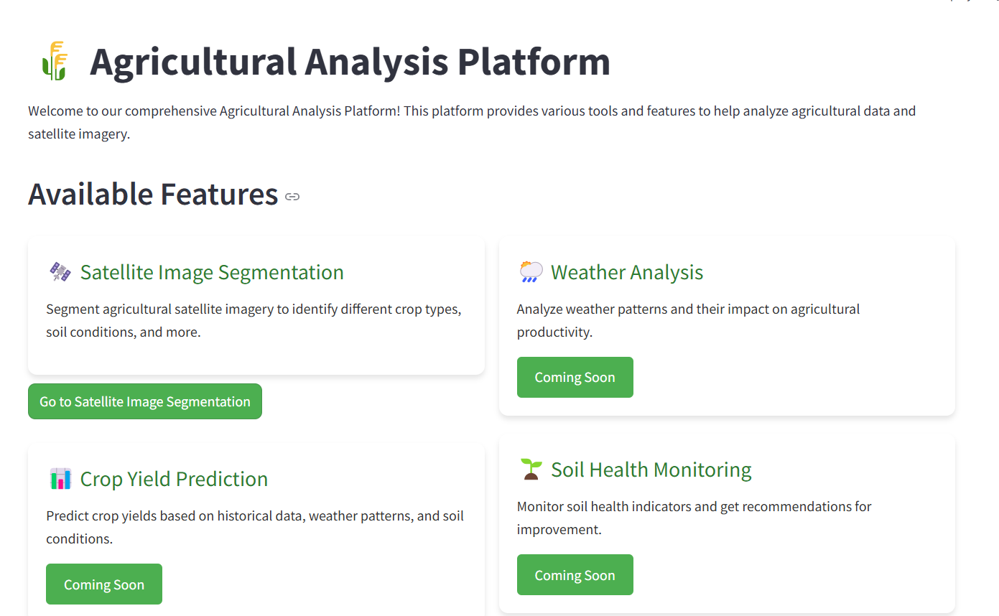
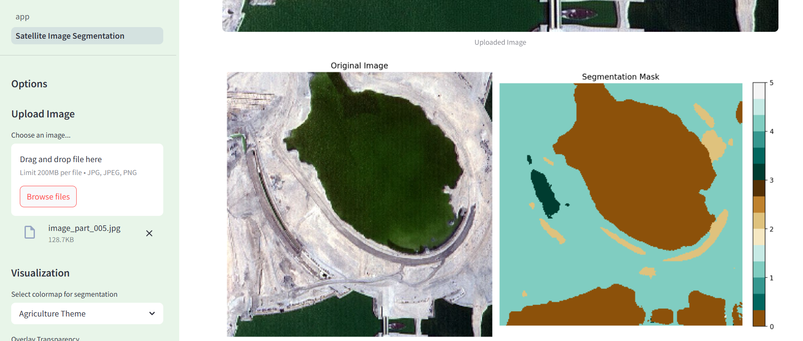
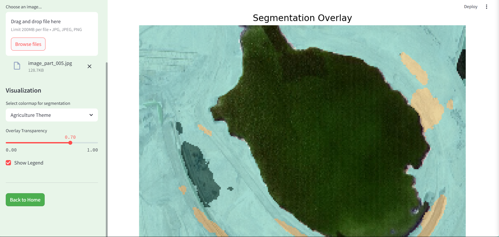
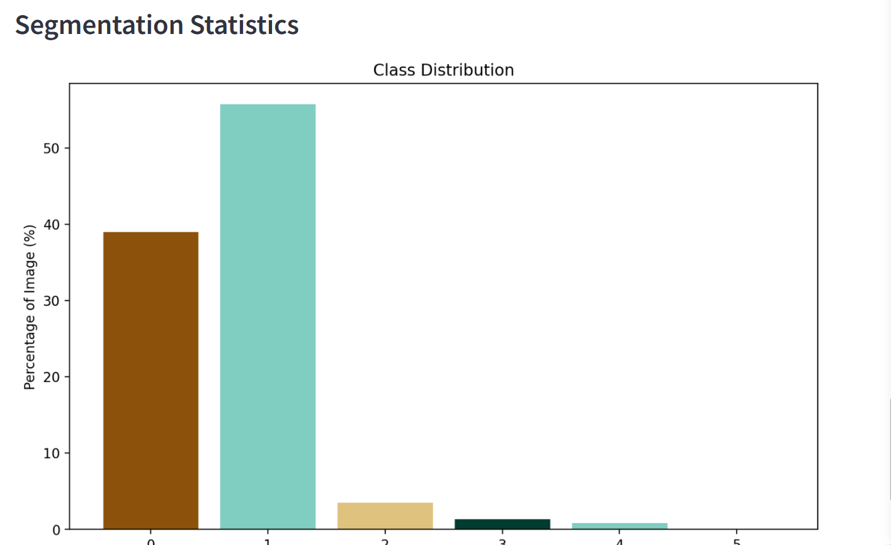

# Agricultural Satellite Image Segmentation
## Overview
This project provides a powerful tool for agricultural satellite image segmentation using deep learning. The application can identify and segment different agricultural features from satellite imagery, helping farmers, researchers, and agricultural professionals gain valuable insights from remote sensing data.

## Features
- Image Segmentation : 

- Interactive Visualization : View segmentation masks with customizable colormaps

- Overlay Analysis : See segmentation results overlaid on the original image with adjustable transparency

- Statistical Analysis : Get detailed statistics about the segmentation results

- Download Options : Save visualization results for reports and further analysis

## Demo
## Installation
### Prerequisites
- Python 3.7+
- TensorFlow 2.x
- Streamlit
- OpenCV
- NumPy
- Matplotlib
- PIL
### Setup
1. Clone this repository:
```
git clone https://github.com/yourusername/agricultural-satellite-segmentation.git
cd agricultural-satellite-segmentation
 
```

2. Install the required dependencies:
```
pip install -r requirements.txt
 ```

3. Download the pre-trained model:
   - Ensure the model file model_epoch_150.h5 is in the root directory of the project
## Usage
1. Run the Streamlit app:
```
streamlit run app.py
 ```

2. Navigate to the Satellite Image Segmentation page from the home screen
3. Upload your satellite image using the file uploader in the sidebar
4. Adjust visualization settings as needed:
   
   - Select a colormap for the segmentation mask
   - Adjust overlay transparency
   - Toggle legend visibility
5. View the results and download visualizations for your reports
## Dataset
The model was trained on a dataset of agricultural satellite imagery. Sample images are included in the data folder for testing purposes.

## Model Architecture
The segmentation model uses a U-Net architecture with the following characteristics:

- Encoder-decoder structure for precise segmentation
- Custom Jaccard coefficient metric for optimization
- Trained for 150 epochs on agricultural satellite imagery
## Project Structure
```plaintext
agricultural-satellite-segmentation/
├── app.py                         # Main application entry point
├── pages/                         # Streamlit pages
│   └── 1_Satellite_Image_Segmentation.py  # Segmentation page
├── model_epoch_150.h5             # Pre-trained segmentation model
├── data/                          # Sample data for testing
│   ├── images.jpg         # Sample input image
├── requirements.txt               # Project dependencies
└── README.md                      # Project documentation
 ```

## Future Improvements
- Time-series analysis for crop growth monitoring
- Integration with other agricultural data sources
- Export of geospatial data formats (GeoTIFF, Shapefile)
- Mobile-friendly interface
## Contributing
Contributions are welcome! Please feel free to submit a Pull Request.

## License
This project is licensed under the MIT License - see the LICENSE file for details.

## Acknowledgments
- Thanks to kaggle for the  satellite imagery
- The segmentation model architecture is based on unet
- Streamlit for the interactive web application framework
